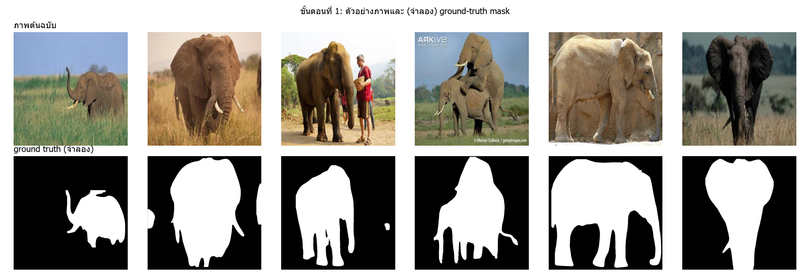
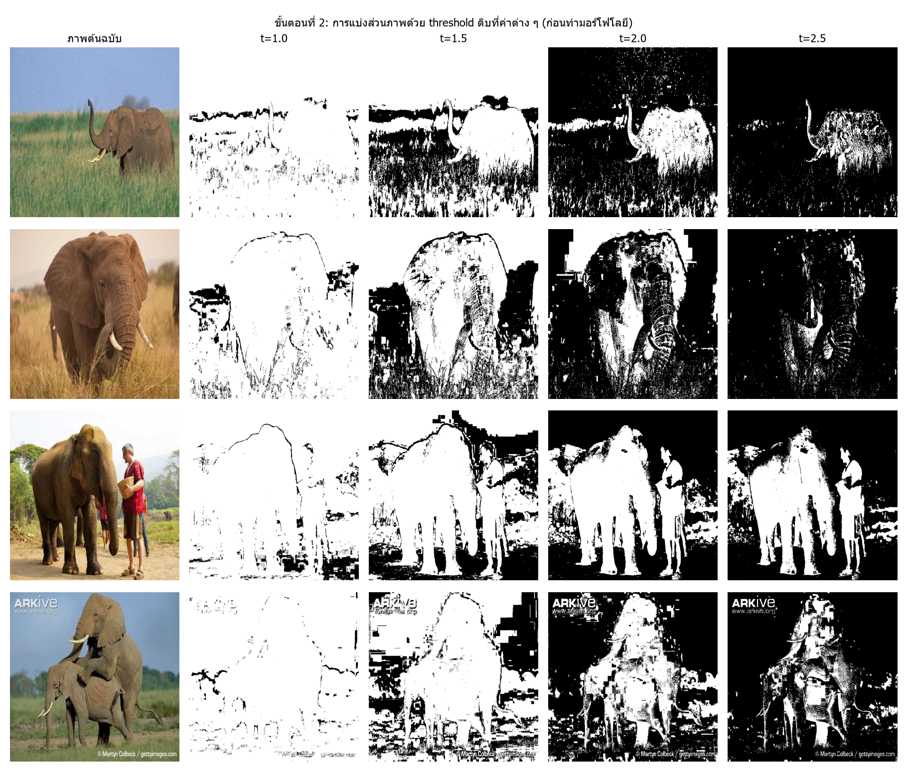
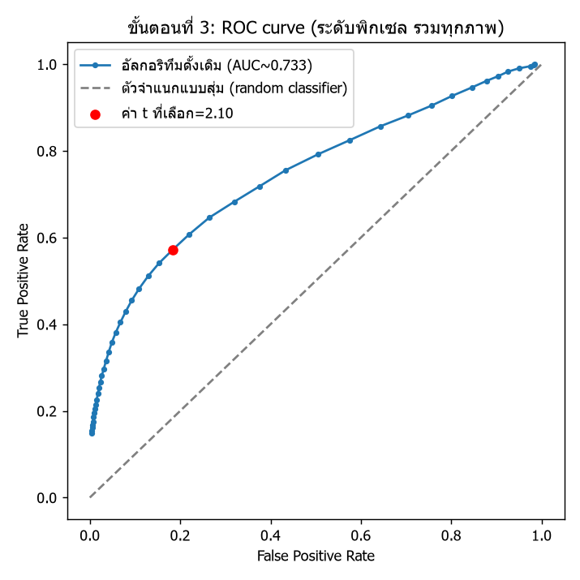
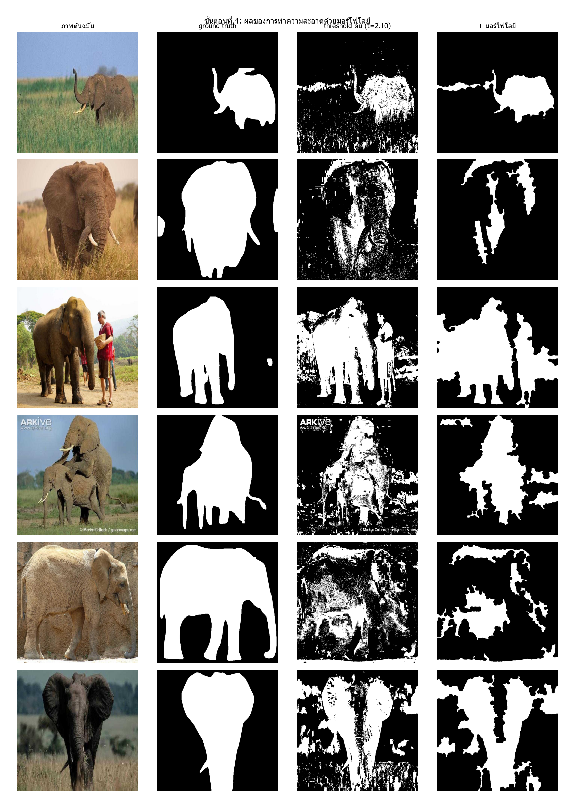
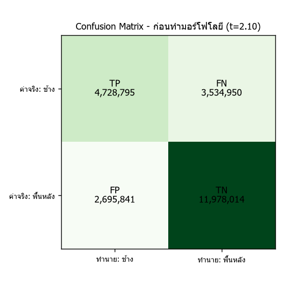
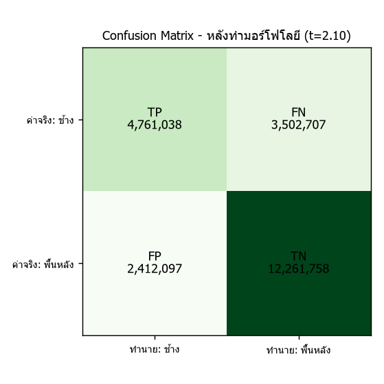
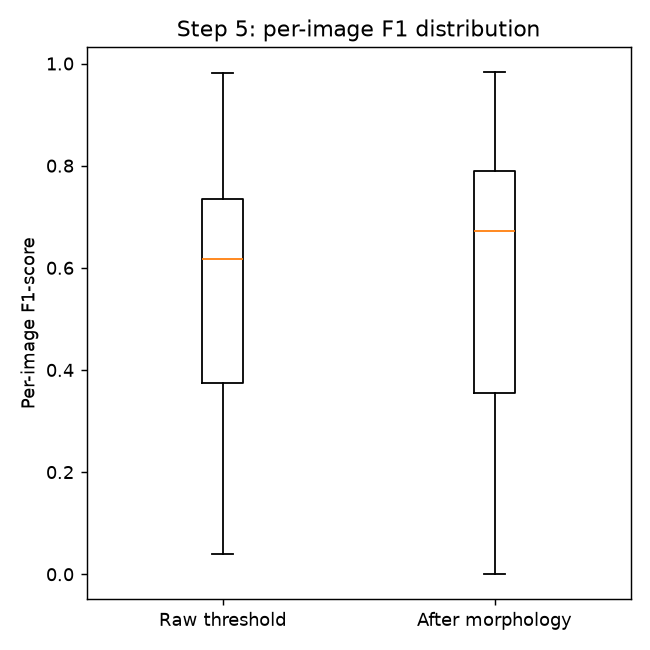

# สรุปผลโครงการ: การแบ่งส่วนภาพช้าง (Elephant Segmentation) ด้วยการประมวลผลภาพเชิงมอร์โฟโลยี

**รายวิชา:** Digital Image Processing — Lecture 10 (Morphological Processing)
**ชุดข้อมูล:** `raw_data/` ภาพถ่ายช้าง 56 ภาพ (ส่งออกจาก Roboflow)

---

## 1. เป้าหมายของโครงการ

แบ่งส่วนภาพ (segmentation) เพื่อแยก **ช้าง (foreground)** ออกจาก **พื้นหลัง (background)** โดยใช้อัลกอริทึมแบบดั้งเดิม (classical, ไม่ใช้ deep learning สำหรับตัวแบ่งส่วนเอง) ร่วมกับตัวดำเนินการเชิงมอร์โฟโลยีเพื่อปรับปรุงผลลัพธ์ แล้วประเมินผลด้วย Confusion Matrix และ ROC Curve

## 2. ชุดข้อมูลและ Ground Truth

- ภาพทั้งหมด **56 ภาพ** สัดส่วนพิกเซล foreground (ช้าง) เฉลี่ยใน ground truth อยู่ที่ **36.0%**
- เนื่องจาก `raw_data/` มีเฉพาะภาพดิบ ไม่มี mask กำกับมาให้ จึงสร้าง ground truth เองด้วย `01_generate_ground_truth.py`:
  - **วิธีหลัก:** YOLOv8x-seg (instance segmentation ที่เทรนบน COCO) เก็บเฉพาะ mask ที่โมเดลทำนายว่าเป็นคลาส "elephant"
  - **วิธีสำรอง (3/56 ภาพ):** ใช้ saliency mask ทั่วไป (U2-Net ผ่าน `rembg`) สำหรับภาพที่ YOLO ตรวจไม่พบช้างเลย

## 3. อัลกอริทึมแบ่งส่วนภาพแบบดั้งเดิม

แนวคิด: แถบขอบภาพบาง ๆ มักเป็นพื้นหลังเสมอ จึงสุ่มตัวอย่างสีบริเวณขอบภาพในปริภูมิสี **CIE-Lab** คำนวณระยะห่างสีแบบ Euclidean (z-score) ของทุกพิกเซลเทียบกับสถิติสีพื้นหลังนั้น แล้วกำหนด threshold `t` เพื่อได้ mask ไบนารี (พิกเซลที่ห่างจากสีพื้นหลังมาก = ช้าง)

## 4. การเลือก Threshold ด้วย ROC Curve

ไล่ค่า threshold ทั่วทั้งชุดข้อมูล (ระดับพิกเซล รวมทุกภาพ) แล้วเลือกจุดที่ให้ค่าสถิติ **Youden's J (TPR − FPR) สูงสุด**

| ตัวชี้วัด | ค่า |
|---|---|
| Threshold ที่เลือก (t) | **2.10** |
| ROC AUC | **0.733** |
| TPR ที่จุดเลือก | 0.572 |
| FPR ที่จุดเลือก | 0.184 |

AUC ~0.733 ดีกว่าตัวจำแนกแบบสุ่ม (0.5) อย่างชัดเจน แต่ยังห่างจากตัวจำแนกสมบูรณ์แบบ (1.0) เพราะอัลกอริทึมนี้ใช้เพียงสี และเป็นกฎแบบ global ต่อภาพ ขณะที่พื้นหลังจริงมีความหลากหลายสูง (หญ้าเขียว หญ้าแห้ง ดิน ท้องฟ้า น้ำ)

## 5. การปรับปรุงด้วยมอร์โฟโลยี

หลัง threshold แล้ว mask ยังมีสัญญาณรบกวน จึงทำความสะอาดด้วยลำดับตัวดำเนินการ:

1. **Opening** (erosion → dilation) — ลบจุดสัญญาณรบกวนเล็ก ๆ
2. **Closing** (dilation → erosion) — เติมช่องว่าง/รอยขาดเล็ก ๆ
3. **Region filling** — เติมรูที่ถูกล้อมรอบให้เต็ม
4. **Small-blob removal** — ตัดก้อนที่มีขนาดเล็กกว่า 1% ของพื้นที่ภาพทิ้ง

## 6. ผลการประเมิน (Confusion Matrix ระดับพิกเซล รวมทั้งชุดข้อมูล)

| ตัวชี้วัด | Threshold ดิบ | หลังทำมอร์โฟโลยี |
|---|---|---|
| Accuracy | 72.84% | **74.21%** |
| Precision | 63.69% | **66.37%** |
| Recall (TPR) | 57.22% | **57.61%** |
| Fall-out (FPR) | 18.37% | **16.44%** |
| F1-score | 0.6028 | **0.6168** |

| Confusion Matrix | ก่อนมอร์โฟโลยี | หลังมอร์โฟโลยี |
|---|---|---|
|  | | |
|  | | |

การกระจายตัวของ F1-score รายภาพ (ก่อน/หลัง) แสดงว่าภาพส่วนใหญ่ดีขึ้นหรือเท่าเดิมหลังทำมอร์โฟโลยี:

## 7. สรุปผลการวิเคราะห์

- **False positive ลดลงชัดเจน** — การทำ opening ช่วยลบพื้นที่พื้นหลังเล็ก ๆ ที่แยกตัวออกมาซึ่งถูกจำแนกผิดจากสัญญาณรบกวนของสี (เช่น หญ้าโดนแดด หรือเงา)
- **Precision และ Accuracy ดีขึ้น** จาก closing + region filling + small-blob removal ที่เปลี่ยน mask จุด ๆ ให้เป็นก้อนต่อเนื่อง
- **Recall เปลี่ยนแปลงเพียงเล็กน้อย** — เพราะ opening ด้วย kernel ขนาดคงที่ไปกัดเซาะโครงสร้างบาง ๆ ของช้าง (ปลายงวง หาง ขาเรียว ขอบหู) ทำให้ TP บางส่วนกลายเป็น FN
- **F1-score โดยรวมดีขึ้น** ยืนยันว่ามอร์โฟโลยีไม่ได้สร้างข้อมูลใหม่ให้ตัวจำแนก แต่ช่วย "ทำความสะอาด" รูปทรง/สัญญาณรบกวนได้โดยแทบไม่แลกกับความแม่นยำ

## 8. ข้อจำกัด

1. **Ground truth สร้างจากโมเดล ไม่ได้ตรวจสอบโดยมนุษย์** — มาจาก YOLOv8x-seg (เฉพาะคลาสช้าง) + saliency สำรอง (U2-Net) สำหรับ 3 ภาพ ตัวเลขจึงควรอ่านเชิง *เปรียบเทียบ* (ดิบ vs. หลังมอร์โฟโลยี) มากกว่าความแม่นยำระดับงานวิจัยตีพิมพ์
2. **ใช้ threshold แบบ global ค่าเดียวต่อภาพ** — มีปัญหาเมื่อพื้นหลังมีลวดลาย/ความหลากหลายสูง หรือสีช้างใกล้เคียงพื้นหลัง (เช่น ช้างเปื้อนโคลน)
3. **ขนาด structuring element คงที่** — ไม่ปรับตามขนาดช้างในแต่ละภาพ ทำให้รายละเอียดเชิงกายวิภาคบางส่วนถูกกัดเซาะ

## 9. แนวทางปรับปรุงในอนาคต

- ใช้ threshold แบบปรับตัวได้ (adaptive/local) แทนค่าสถิติสี global
- เพิ่ม feature ด้านลวดลาย (texture) นอกเหนือจากสี
- ปรับแต่งผลด้วย GrabCut โดยเริ่มจาก mask ที่ผ่านมอร์โฟโลยีแล้ว
- ใช้โมเดล deep learning segmentation เป็นตัวเปรียบเทียบขีดจำกัดบน (upper bound)

## 10. สรุปขั้นตอนโดยย่อ

| ขั้นตอนของเวิร์กชอป | สิ่งที่ทำ |
|---|---|
| 1. เลือกงานแบ่งส่วนภาพ | ช้าง (foreground) เทียบกับพื้นหลัง |
| 2. ชุดข้อมูล ≥ 50 ภาพ + ground truth | 56 ภาพ; ground truth จาก YOLOv8x-seg + saliency สำรอง 3 ภาพ |
| 3. ออกแบบอัลกอริทึมแบบดั้งเดิม | Threshold จากระยะห่างสี Lab เทียบสีขอบภาพ |
| 4. ปรับปรุงด้วยมอร์โฟโลยี | Opening → Closing → เติมรู → ลบก้อนเล็ก |
| 5. ประเมินผล | Confusion Matrix + ROC Curve (ดูหัวข้อ 4 และ 6 ข้างต้น) |
| 6. นำเสนอผล | โน้ตบุ๊ก `elephant_segmentation_workshop_TH.ipynb` + รูปภาพใน `outputs/` |

---
*สรุปนี้อ้างอิงจากผลลัพธ์ที่บันทึกไว้ใน `outputs/metrics_summary.json` และโน้ตบุ๊ก `elephant_segmentation_workshop_TH.ipynb`*
